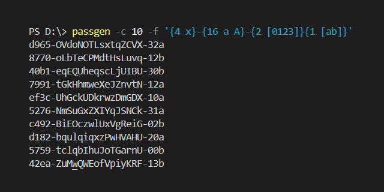

# PASSGEN
Simple tool to generate secure passwords, tokens etc, for you or your project.

# Requirements
- Python 3.10+
- Linux or Windows
- (*optional*) *clipboard* module to copy password in clipboard, if run as app 

# How to use
## As app
Just copy *passgen.py* to any directory, that located at *PATH* variable (or add your custom folder to this variable).

For Linux - */usr/bin/* for example and `sudo chmod +x passgen.py`. After you will able to call `passgen.py`

For Windows - *C:\\ProgramFiles\\Scripts\\* for example and add this folder to *PATH*. After you will able to call `passgen` or `passgen.py`

Running `passgen.py` without arguments returns default password. To change password format use `-f` key: `passgen.py -f "{4 d}"` will return pin-code. See `passgen.py -h`!

## As module
It's recommended to import only function like `from passgen import passgen`

# Password formatting
### how `format` works
Generated chars replaces instead of `{}`. You can write rule in it to format output result. 
Symbols out of `{}` will be static. Use `\{` and `\}` to 
place braces out of placeholder. Number in braces describes how many symbols to generate. 
If format is wrong, will raise ValueError or handle it as static string.

For example `{16}` returns password of `DEFAULT_CHARSET` symbols with length 16.

You can use presets of different charsets; write it after length. For example
`{8 x}-{4 x}-4{3 x}-{1 [89ab]}{3 x}-{12 x}` returns UUID like format in lowercase.

### charsets
You can combine charsets. Duplicates don't affect to probability. Example `{16 A a d [-+$%=\[\]/]}`
- A -> ascii upper letters
- a -> ascii lower letters
- d -> digits
- X -> upper hex
- x -> lower hex
- s -> symbols from `SYMBOLS_CHARSET`
- S -> extended symbols that includes dot, coma etc
- o -> oct
- [] -> your symbols in `[]`; `\[`, `\]`, `\{` and `\}` to use them as target symbols

### excluding symbols
If you use some build-in charsets you can also exclude symbols with `![]`. For example
`{16 A a s ![-_/]}` returns password without `-`, `_` and `/`
